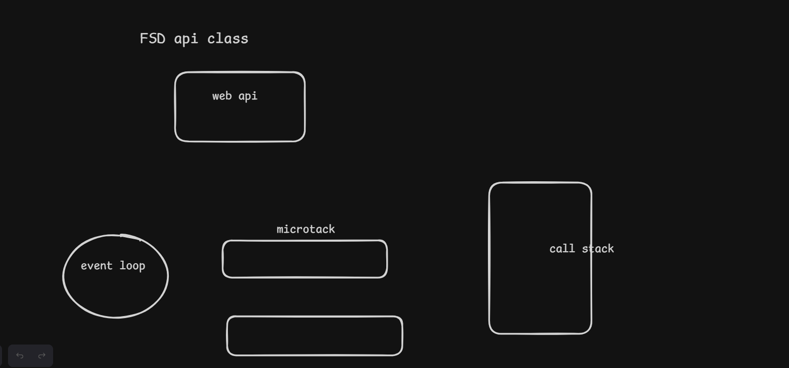

client server aarchitecture --- client and server side loading
3 tier architecture , multi-tier architecture
tcp/ip
osi
sdlc
html css grid and js
-- js -----
js Hoisting , TDZ , js array and string methods , synchronous and asynchronous function ,

class 2 ---

grid and flex
1--count row and column
2-- row-height
3 -- column - width
in style 1fr is i fraction we do not use pixel as it might not cover the whole screen so we use fraction value ie 1fr 1fr 1fr 1fr ie windoe into 4 section equal width

for mobile view responsive prompt --
1- make the existing web page proper responsive
2- add a hamburger menu
3-- add some good animation and transactions
4-- make sure all the content are wrapped inside its particular container
5-- for better responsiveness make the webpage responsive for all the mobile and tablet view
crosser(backend) lovaable dpaste

jsx

jsx uses bot compiler and interpreter line by line executes code(synchronous function)

in var we can redeclare and reassign the value
in let we can not redeclare but can reassign the value

eg--
a=10;
cos(a)
let a
will give error

eg 2--
a=10;
cos(a)
let a

will give 10

Hoisting -- In hoisting the variable and function declaration will move to top of the scope
Hoisting will perform only in var variable.

TDZ --

// normal function

function demo(a,b){
console.log(a+b)
}
demo(5,10)

// arrow function

const demo=(a,b)=>{
console.log(a+b)
}
demo(5,10)

difference between regular and arrow function (return)

-- callback function
if a pass a function inside another function as an argument it is called callback function

// callback function
function sample(callback){
console.log("sample")
callback()
}
function demo(){
console.log("demo1")
}
sample(demo)

accessibility of outer fuction inside inner function
closure is made by lexical scope
lexical scope is the surrounding state
closure is a combination of lexical scope and function

1.  let , const and var 2. hoisting and TDZ 3. types of functions.
    regular function
    arrow function
    callback function
    first order function
    higher order function
    self invoking function

day 3 -----------------------------------------------------------------------------------------------------------------------------
parameter and argument
Microsoft engine name of different browsers

Synchronous and asynchronous function
synchronous -- we can not move to another task before the previous one finishes its execution-- blocking code
asynchronous-- we can move to another task before the previous one finishes its execution -- non blocking code
is js synchronous or asynchronous-- js is synchronous but most of the time we are performing functions using asynchronous

settimeout-- used in website like when user opens a website and gets discount message in 5 sec or 10 sec after login
js first execute synchronous code it will always execute synchronous code first then asynchronous code

code --
setTimeout(()=>{
console.log("hello")
},1000)
// also example of callback function -- settimeout

console.log("1")
function demo(){
console.log("2")
}
demo()
console.log("3")

callbackhell

when we are using multiple callback function in a nested callback it will create callback hell

drawback--
hard to debug
read readability is not good

eg--
setTimeout(()=>{
console.log("1")
setTimeout(()=>{
console.log("1")
setTimeout(()=>{
console.log("1")
},1000)
},1000)
},1000)

so promises came to solve this problem
promise is a object constructor

code--
let pro =new Promise((res,rej)=>{
var quiz = "top"
if(quiz=="top"){
res()
}
else{
rej()
}
})
pro.then(()=>console.log("yes"))
.catch(()=>console.log("no"))

if we have both promise and settimeout then promise will be executed first becaue of its priority

call stack is a mechanism which keeps track of every process which is being run in the environment

event loop-- vvimp

event loop is a constantily running process which checks the call stack is empty or not if it found callstack empty ( all the synchronous already executed) it will push one by one asynchronous function from callback queue to the callstack

all the asynchronous reside in webapi then microtask

microtask only have promises and will be executed first and macrotask has settimeout etc which will execute after microtask
callstack will have synchronous function and event loop will continuously check the stack to empty

Day-4-----------------------------------------------------------------------------------------------------------------------------------------------------------------------------

async and await
1- async function always returns a promise
2- after await, always use a promise
3- Async and Await manages promise in a better way

json

json is array of objects
we use 2 methods for api fetching
we DO NOT USE LOOPING
we use .map and .foreach

arrow function does have return

Day 5------------------------------------------------------------------------------
Local storage -- permanent storage till we manually delete it
session storage -- till the time our tab is open we have
session storage the time we close the tab we lost session storage
cookies-- can have reset time and also used to store essestial information
cookies 3 types--
1- session cookies
2- persistent cookies-- short duration data(7 days , 10 days)
3- Third party cookies -- collects data

single(react) and multipage application(js)
in js page when changes reloads takes time when heavy component

rafce shortcut key to generate jsx code
<></> react fragment -- when we have multiple line of code inside return in jsx file

babel compiler of jsx
component is indepenndent and is reusable code

Virtual DOm in notebook

Day-6------------------------------------------------------------------------------------------------------------------------

why use react instead of jsx and html--

REACT FEATURE
----- vimp ------1- Virtual DOM - imp
2- Single Page Application(SPA) - imp
3- JSX and Babel - imp
4- One Way Data Binding
5- Component Based

Virtual Dom -- In copy ---

React lifecycle
Mounting,Updating,Unmounting

component-- Class component(React lifecycle) and functional component
functional component - Hooks
Hooks--
-- Hooks are functtions
-- There is 2 rules to use hooks
-- 1- only call hooks from top level (top of the component)
-- 2- Only call hooks from react functions

state
we can not rerender from normal variable so we use state

where to use ternary operator
show/hide
dark/light theme
toggle

useState example(2-3) -- manages state

Html name attribute -- place in url used for data (jab hame backend me usl bhejna hota hai toh usme url main values chiye hoti hai uss ke like name ke use karte hai woh values ko url main load kar deta hai)

name and value attribute in html
onchange is used in input tag maximum time

multiple form handling

useEffect

day-9------------------------------------------------------------------------------------------------------------------------------
useEffect -- api fetch , data retrieve,-- manages sideeffect
side effect is aany operation that affects somehthing outside of the scope of the function

useEffect affects 2 argument -- calllback and dependency

useEffect(()=>{
// side effect
return ()=>{
// clean-up/unmounting function
}
},[]) //dependency array

    if []//dependency array is empty then useEffect will run 1 times

create 2 counter button when you clcik onn the first counter button the pop up will appear every time and when you click on the second counter button pop up should not appear

differnece between settimeout and setinterval(baar baar update hoga jitna deay diya hai)

any parameter in a state will trigger previous state

rerendering issue

how can we replace lifecyle with functional components -- by hooks

routing--

browser router
routes
route
link
navlink

day-10------------------------------------------------------------------------------------------------------------------------------------------------------------------------------
props and props drilling- passing data to a single file

Difference between (arrays)map and for each(looping)
difference b/w map , filter and reduce
difference between find and filter
difference between some and every
difference b/w push , pop , shift and unshift

context api-- passing data across the component

- createContext
- provider
  usecontext hooks - to pass data

------------------------------------------------------------------------------------------------------------------------------------------------------------------------------------------------------------------------------------------

Node and Express

npm- node package manager
